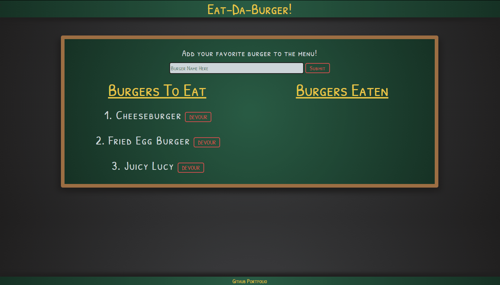
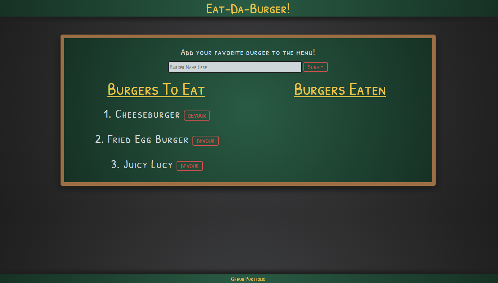

# Eat-Da-Burger

#### Table of Contents
  * [Description](#Description)
  * [Installation](#Installation)
  * [Screenshots](#Screenshots)
  * [Credits](#Credits)
  * [License](#License)

## Description
Have you ever wanted to keep track of all the burgers you've consumed and have yet to consume, then this is the app for you! Eat-Da-Burger allows user's to add burgers via text-input and then devour them. Burgers devoured move to a separate list.

Click [Here](https://whispering-bayou-19745.herokuapp.com/) to view the Heroku deployment.
 
## Installation
#### Technologies Used
* HTML
* JavaScript
* [MySQL](https://www.mysql.com/) & [MySQL Workbench](https://www.mysql.com/products/workbench/)
* [Bootstrap](https://getbootstrap.com/)
* [Node](https://nodejs.org/en/) and [npm](https://www.npmjs.com/package/npm)
* [Visual Studio Code](https://code.visualstudio.com/)
* [cmder](https://cmder.net/)

#### Steps
1. * Start by entering the following in your terminal: `Git clone https://github.com/whackingMUFN/Eat-Da-Burger.git`

2. * Change directory to `Eat-Da-Burger` and enter `npm install` into your terminal. This will install all package dependencies.

3. * Add node_modules to .gitignore.

4. * Create a `config.js` file based on the template [here](./config/config.js.example).
    * If file `config.js` is created in another location other than the parent folder, remember to update `server.js` `const credentials = require('./config')` with the new relative path.
    * Replace `<ID>` in the `user` and `password` fields in `config.js` with the credential information for the database.

5. * Copy Database and Table setup from `./db/schema.sql`
        * Paste into MySQL Workbench and execute.
6. * Copy table data from `./db/burgerSeed.sql` 
        * Paste into MySQL and execute only the `INSERT INTO ...  VALUES (...)` information code blocks for each table. This can be done by selecting/highlighting the desired code blocks and clicking the lightning bolt.

* Start the application by running `npm start`

## Screenshots
#### Eat-Da-Burger

#### Home Page
 

## Credits
This assignment was provided by Trilogy Education Services. All files were created based on in class activities and lectures, [MDN](https://developer.mozilla.org/en-US/) Reference Documents for JavaScript syntax [JSHint](https://jshint.com/) for JavaScript validation, and various other online resources. 
## License

[License](LICENSE)
MIT &copy; 2020 Calvin Freese
